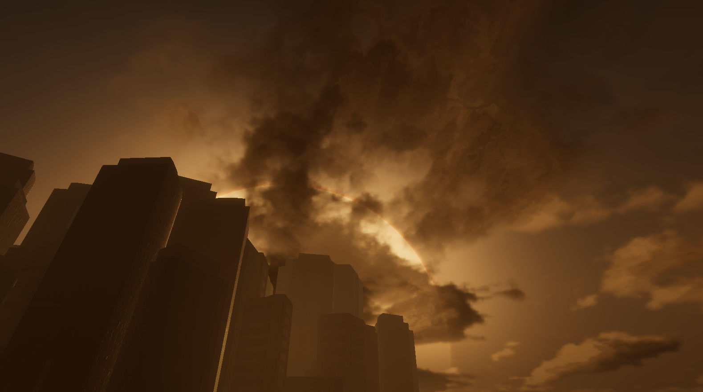
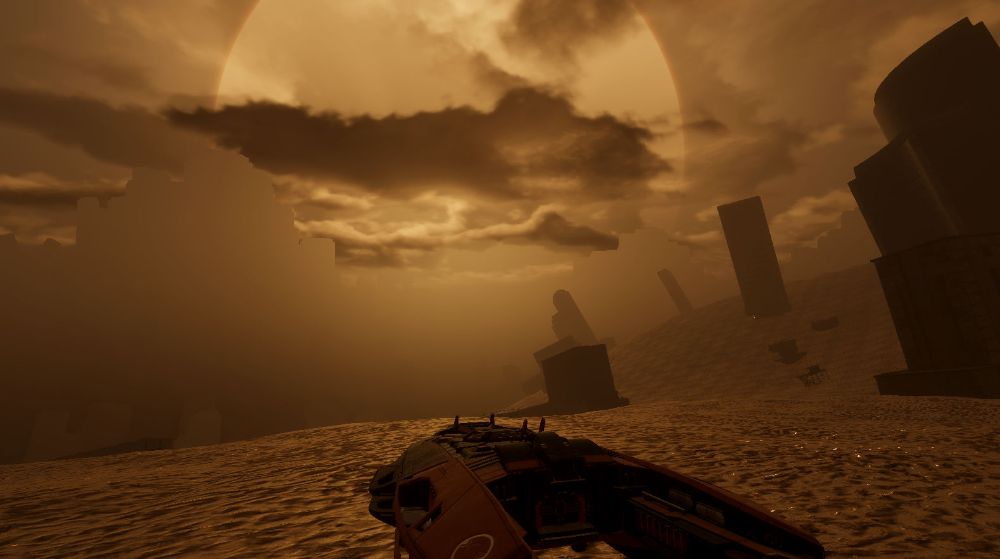

# HEIG-VD-TB: Open World Game Prototype

Author: Simon Guggisberg

|  |  |
|-|-|

Short video Demo available here :

More in depth video Demo available here :

This repository containing all information related to my Bachelor's thesis.

This bachelor's thesis is an exploration of many state-of-the-art performance techniques under the guise of an open world game prototype.

## First Formulation

The first formulation is available only as an informative piece.
It is located in the [formulation](/formulation/TB_first_formulation_OWP.typ) subfolder.

## Report

The report is written using `Typst 0.13.1`.
A PDF export is available for each release of the project.

The typst files are located in the [report](/report/main.typ) subfolder.

## Poster

A poster summarizing the work is available as `.pptx` and `.pdf`
Both are located in the [poster](/poster/TB_SG_affiche.pdf) subfolder.

## Application

The application is built using `Unity 6000.0.39f1`.
The project files are located in the [unity](/unity/) subfolder.
System Requirements for a Unity HDRP project can be found [here](https://docs.unity3d.com/Manual/system-requirements.html#editor).

## GitHub Project

It is linked to the GitHub repository and can be found [here](https://github.com/users/GuggisbergSimon/projects/2).

## CI/CD

In order to run the GitHub Actions:
- Refer to [GameCI documentation](https://game.ci/docs/github/activation) regarding secrets to be added to your repository.
- Create a tag labelled `v.*` with the version number you want.
- Push it to the remote.

A release with a PDF of the report and builds for Linux and Windows will be created on GitHub after a while.

## Releases

Builds of the application are located in the [releases](https://github.com/GuggisbergSimon/HEIG-VD-TB/releases/latest) tab of the GitHub repository.

Supported platforms are Windows and Linux, with those requirements for [Unity](https://docs.unity3d.com/Manual/system-requirements.html#desktop) [HDRP](https://docs.unity3d.com/Packages/com.unity.render-pipelines.high-definition@17.3/manual/System-Requirements.html).
